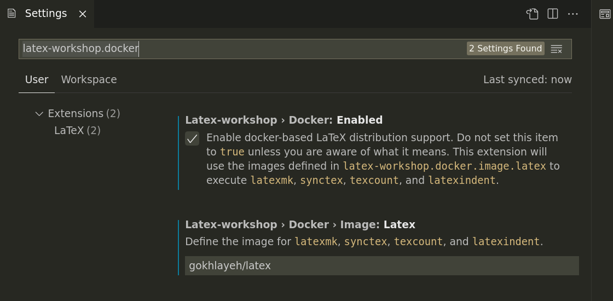

# latex

[](https://hub.docker.com/r/gokhlayeh/latex)
[](https://results.pre-commit.ci/latest/github/ChiefGokhlayeh/latex/master)
[](https://github.com/ChiefGokhlayeh/latex/actions/workflows/build-and-test.yml)

A Docker-based LaTeX distribution with support for BibLaTeX and PythonTeX.

## Prerequisites

It is assumed you already have the following packages installed. They area available for pretty much any OS.

- [Docker](https://docs.docker.com/engine/install/) or [Podman](https://podman.io/)
- [Visual Studio Code](https://code.visualstudio.com/)
  - [LaTeX Workshop Extension](https://marketplace.visualstudio.com/items?itemName=James-Yu.latex-workshop)

## Usage

Open Visual Studio Code and switch to the _Settings_ menu (`Ctrl + ,`). In the search bar type `latex-workshop.docker.enabled` and tick the checkbox, that says "**Latex-workshop › Docker: Enabled**". Next search for `latex-workshop.docker.image.latex` and enter `gokhlayeh/latex` in the textbox, that says "**Latex-workshop › Docker › Image: Latex**". See screenshot below.



Alternatively paste the following lines to your `.vscode/settings.json`.

```jsonc
{
  /* more settings go here */
  "latex-workshop.docker.enabled": true,
  "latex-workshop.docker.image.latex": "gokhlayeh/latex"
}
```

Now, whenever you open and save a `.tex` file, LaTeX Workshop should start building the PDF. Note that first build may take some time, as LaTeX Workshop has to download the image first.

### PythonTeX

The Docker image ships with a basic install of Python 3.x to support [PythonTeX](https://www.ctan.org/pkg/pythontex). If you want to use additional Python libraries you will need to either add them to the image manually, or create your own image based on this one. Your `Dockerfile` may look like this:

```Dockerfile
FROM gokhlayeh/latex:latest

RUN dnf install -y --setopt=install_weak_deps=False \
    python3-numpy
```

For examples on how to use the included PythonTeX in your LaTeX document and other features of this image, refer to the contents of [`test/`](test) directory.

If you're using LaTeX Workshop, don't forget to tag your image and update `"latex-workshop.docker.image.latex": "..."` accordingly.

### GNU Plot

GNU Plot is a useful tool to quickly render 2D or even 3D graphs. This image comes with `gnuplot` pre-installed, allowing you to render complex graphs from within your `.tex`-file. Several LaTeX packages interface with `gnuplot`, these include the popular `tikz` package. Below is a small demo you can run yourself. Two files need to be created: `.latexmkrc` and `main.tex`.

- `.latexmkrc` - Configuration file for `latexmk`, the build tool LaTeX Workshop uses to build your document.

  ```perl
  # Tell latexmk to look for a files with the extension *.gnuplot. Any matching
  # files will be passed to the function, "run_gnuplot", defined below. The output
  # will be a *.table file, which tikz can read.
  add_cus_dep('gnuplot', 'table', 0, 'run_gnuplot');

  sub run_gnuplot {
      # When using the gokhlayeh/latex docker image the shell is invoked without
      # locale. This causes the warning:
      #   "line 0: warning: iconv failed to convert degree sign",
      # which latexmk interprets as a failed run. We work around the issue by
      # defining a locale (in this case US) before invoking gnuplot.
      my $ret = system "LC_ALL=en-US gnuplot $_[0].gnuplot";

      my ($base, $path) = fileparse($_[0]);
      if ($path && -e "$base.table") {
          rename "$base.table", "$path$base.table";
      }

      return $ret;
  }
  ```

- `main.tex` - An example LaTeX document, showcasing how to render GNU Plot images.

  ```latex
  \documentclass{scrartcl}

  \usepackage{tikz}

  \begin{document}

  Demonstrating gnuplot:

  \begin{tikzpicture}
      % On first build, Tikz will generate a *.gnuplot file with the given
      % instructions. If the LaTeX engine is invoked with --shell-escape, Tikz
      % will invoke gnuplot to produce a *.table file. On the next build, it will
      % see the *.table file and render it accordingly.
      %
      % Note that in this example we use latexmk to convert *.gnuplot files to
      % *.table. Thus the LaTeX engine does not need to be invoked with
      % --shell-escape. Latexmk will also automatically invoke the second build,
      % producing the desired PDF in one call.
      %
      % Check the Tikz and gnuplot manuals to continue from here.
      \draw plot [id=mygraph] function {sin(x)};
  \end{tikzpicture}

  \end{document}
  ```

## Pull the Image Manually

Check out the [Docker Hub](https://hub.docker.com/r/gokhlayeh/latex) page or pull it directly via:

```sh
docker pull gokhlayeh/latex
```
